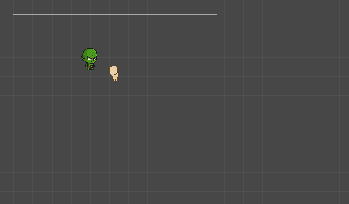

# Coroutine Animator

Simple package for animate simple things

As async engine for animation I use standard Unity Coroutines

Supports sprites animation (and in demo has player realization

(05.03.2021)
