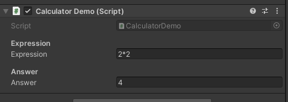

# Expression Calculator

My college project which I created because of boredom in lectures

Simple calculator in several (C#, Python, JS) languages, which can solve expression in string and returns a number (double)

<I>C# and Python version is fully functionality. JS version doesn't contain: power, sqrt, constants like e or pi</I>

<B>Can solve basic operations (+, -, *, /)</B>

<I>In: </I>4-5+6

<I>Out: </I>5

<I>In: </I>6/7*5

<I>Out: </I>4.285714285714286

<B>Some additional operations (^, √, !)</B>

<I>In: </I>5^4

<I>Out: </I>625

<I>In: </I>√625

<I>Out: </I>25

<I>In: </I>7!

<I>Out: </I>5040

<B>Understands where the parentheses are located</B>

<I>In: </I>(4+6)*(7-3)/10

<I>Out: </I>4

<B>It can also understand missing operation symbols</B>

<I>In: </I>((((5)4)3)2)1

<I>Out: </I>120

<I>In: </I>(!+!)^(!+!)

<I>Out: </I>4

<B>And constants (e, pi)</B>

<I>In: </I>5e-2pi

<I>Out: </I>7.308223835115639

<B>Some hard expressions</B>

<I>In: </I>5√(5)!5

<I>Out: </I>273.8612787525831

(01.07.2021)
