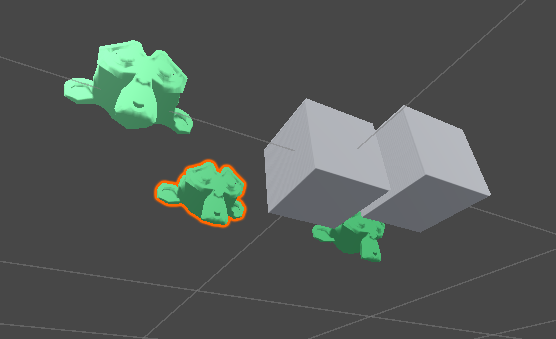

# mesh-transformer
Editor tool for modifying mesh in Unity like transform from usual object

This script solving one of the model import problems - wrong rotation or scale

Just add script on a object, add mesh and modify vertices like it's a usual unity object

# IMPORTANT
When you save mesh, it rewrites original mesh, so make dublicates and be careful

(09.06.2024)
